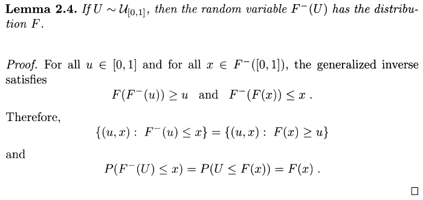
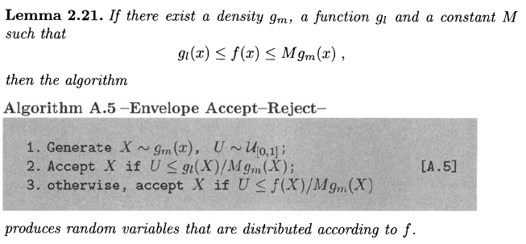
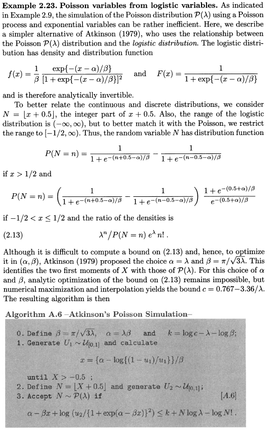

# Algorithms for Generating Random Variables

An important Lemma.



## Box-Muller Algorithm


```julia
function boxmuller()
    x = ones(2)
    u = rand(2)
    logu = sqrt(-2*log(u[1]))
    x[1] = logu * cos(2*pi*u[2])
    x[2] = logu * sin(2*pi*u[2])
    return(x)
end

## example
boxmuller()
```

## Accept-Reject Method


Example:

$$
f(x)\propto \exp(-x^2/2)(\sin(6x)^2+3\cos(x)^2\sin(4x)^2+1)
$$

The Julia code is as follows:

```julia
function AccRej(f::Function, M)
    ## use normal distribution N(0, 1) as sampling function g
    while true
        x = randn()
        u = rand()
        cutpoint = f(x)/(M*g(x))
        if u <= cutpoint
            return([x, f(x)])
        end
    end
end

## density function of N(0, 1)
function g(x)
    return(exp(-0.5*x^2)/sqrt(2*pi))
end

## example function and ignore the normalized constant
function f(x)
    return(exp(-x^2/2)*(sin(6*x)^2 + 3*cos(x)^2*sin(4*x)^2 + 1))
end

## example
N = 500;
data = ones(N, 2);
for i = 1:500
    data[i,:] = AccRej(f, sqrt(2*pi)*5)
end
```

## Envelope Accept-Reject



It is easy to write the Julia code:

```julia
function EnvAccRej(f::function, M, gl::function)
    while true
        x = randn() # still assume gm is N(0,1)
        u = rand()
        cutpoint1 = gl(x)/(M*g(x))
        cutpoint2 = f(x)/(M*g(x))
        if u <= cutpoint1
            return(x)
        elseif u <= cutpoint2
            return(x)
        end
    end
end
```

## Atkinson's Poisson Simulation



It is necessary to note that the parameters in the algorithm are not same with those in the density function. In other words, the corresponding density function of the algorithm should be

$$
f(x) = \beta \frac{\exp(\alpha-\beta x)}{[1+\exp(\alpha-\beta x)]^2}.
$$

The following Julia code can generate the poisson random variable with respect to $$\lambda$$.

```julia
function AtkinsonPois(lambda)
    # parameters
    beta = pi/sqrt(3*lambda)
    alpha = lambda*beta
    c = 0.767 - 3.36/lambda
    k = log(c) - lambda - log(beta)
    # step 1: propose new x
    u1 = rand()
    while true
        global x
        x = (alpha - log((1-u1)/u1))/beta
        x > -0.5 && break
    end
    while true
        # step 2: transform to N 
        N = floor(Int, x)
        u2 = rand()
        # step 3: accept or not
        lhs = alpha - beta*x + log(u2/(1+exp(alpha-beta*x))^2)
        rhs = k + N*log(lambda) - log(factorial(lambda))
        if lhs <= rhs
            return(N)
        end
    end
end

## example
N = 100;
res = ones(Int, N);
for i = 1:N
    res[i] = AtkinsonPois(10)
end
# ans: 8 9 13 10 12 .......
```

As mentioned in the above exercise, another poisson generation method can be derived from the following exercise.


We can write the following Julia code to implement this generation procedure.

```julia
function SimplePois(lambda)
    s = 0
    k = 0
    while true
        u = rand()
        x = -log(u)/lambda
        s = s + x
        if s > 1
            return(k)
        end
        k = k + 1
    end
end

## example for simple poisson
res2 = ones(Int, N);
for i = 1:N 
    res2[i] = SimplePois(10)
end
# ans: 5 7 16 7 10 .......
```


