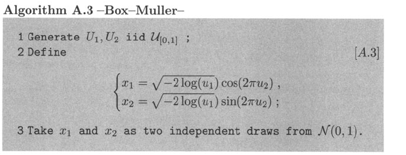

# Algorithms for Generating Random Variables

An important Lemma.


## Box-Muller Algorithm




```julia
function boxmuller()
    x = ones(2)
    u = rand(2)
    logu = sqrt(-2*log(u[1]))
    x[1] = logu * cos(2*pi*u[2])
    x[2] = logu * sin(2*pi*u[2])
    return(x)
end

## example
boxmuller()
```

## Accept-Reject Method


Example:

$$
f(x)\propto \exp(-x^2/2)(\sin(6x)^2+3\cos(x)^2\sin(4x)^2+1)
$$

The Julia code is as follows:

```julia
function AccRej(f::Function, M)
    ## use normal distribution N(0, 1) as sampling function g
    while true
        x = randn()
        u = rand()
        cutpoint = f(x)/(M*g(x))
        if u <= cutpoint
            return([x, f(x)])
        end
    end
end

## density function of N(0, 1)
function g(x)
    return(exp(-0.5*x^2)/sqrt(2*pi))
end

## example function and ignore the normalized constant
function f(x)
    return(exp(-x^2/2)*(sin(6*x)^2 + 3*cos(x)^2*sin(4*x)^2 + 1))
end

## example
N = 500;
data = ones(N, 2);
for i = 1:500
    data[i,:] = AccRej(f, sqrt(2*pi)*5)
end
```


