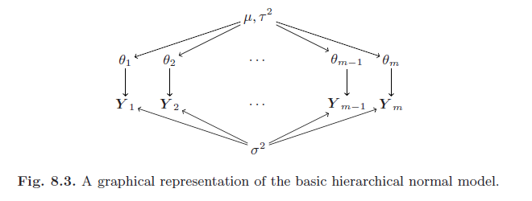
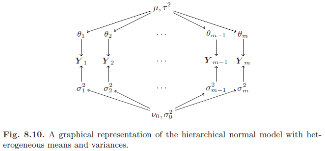
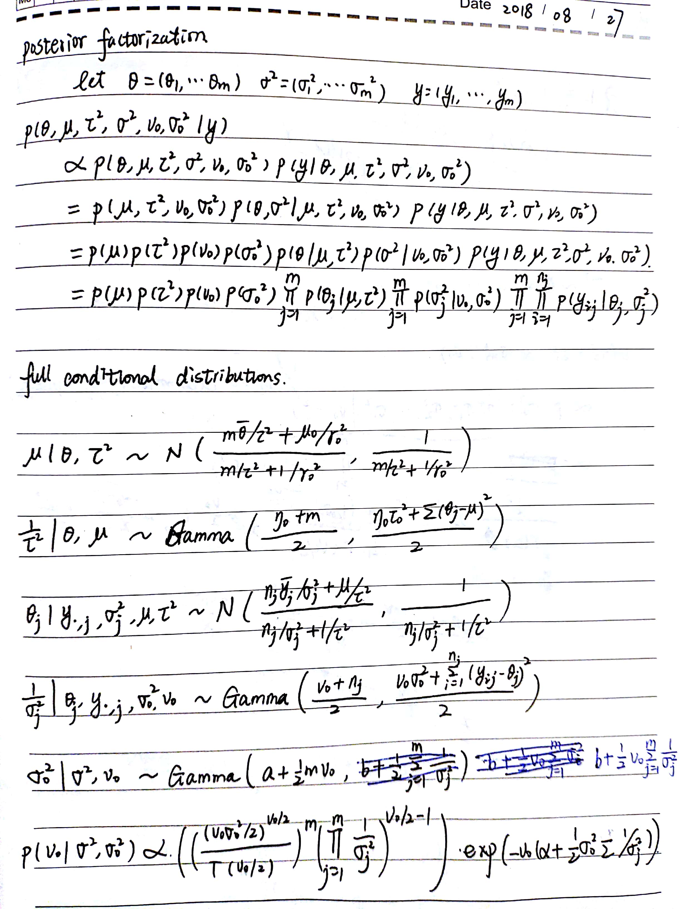
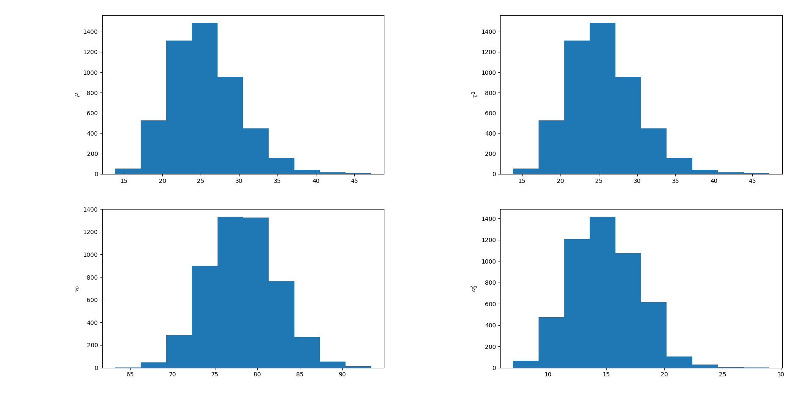
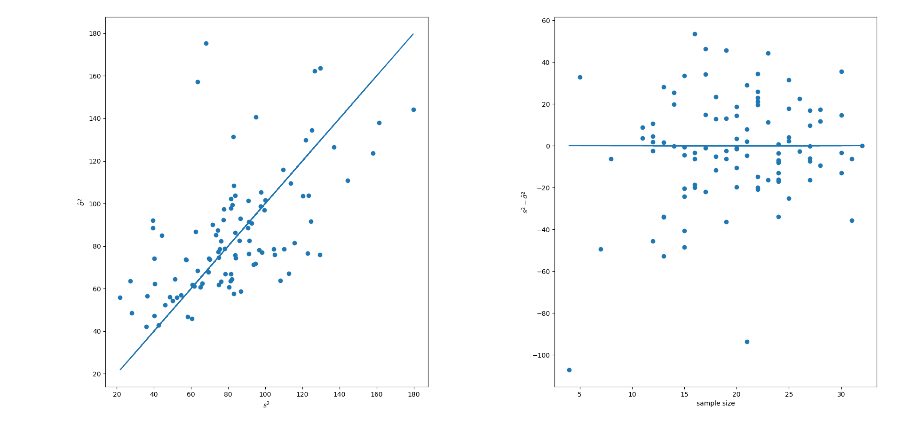

# Group comparisons

## Comparing two groups

This section is based on chapter 8 of [Hoff, P. D. (2009)](https://github.com/szcf-weiya/MonteCarlo/blob/master/References/A_First_Course_in_Bayesian_Statistical_Methods.pdf).

We can use the following R code to approximate the posterior distribution $$p(\mu, \delta, \sigma^2\mid \mathbf y_1,\mathbf y_2)$$.

```r
#!/usr/bin/env Rscript
## R program for Comparing two groups

## get data
## you can found it on Peter Hoff's website
## https://www.stat.washington.edu/~pdhoff/book.php

Y.school.mathscore<-dget("Y.school.mathscore")
y.school1<-dget("y.school1")
y.school2<-dget("y.school2")

y1 = y.school1; n1 = length(y1)
y2 = y.school2; n2 = length(y2)

## prior parameters
mu0 = 50; g02 = 625
del0 = 0; t02 = 625
s20 = 100; nu0 = 1

## starting value
mu = (mean(y1) + mean(y2)) / 2
del = (mean(y1) - mean(y2)) / 2

## gibbs sampler
MU = DEL = S2 = NULL
set.seed(1)
for (s in 1:5000)
{
  # update s2
  s2 = 1/rgamma(1, (nu0+n1+n2)/2, (nu0*s20+sum((y1-mu-del)^2)+sum((y2-mu+del)^2))/2)
  
  # update mu
  var.mu = 1/(1/g02 + (n1+n2)/s2)
  mean.mu = var.mu*(mu0/g02+sum(y1-del)/s2+sum(y2+del)/s2)
  mu = rnorm(1, mean.mu, sqrt(var.mu))
  
  # update del
  var.del = 1/(1/t02 + (n1+n2)/s2)
  mean.del = var.del*(del0/t02 + sum(y1-mu)/s2 - sum(y2 - mu)/s2)
  del = rnorm(1, mean.del, sqrt(var.del))
  
  # save parameter values
  MU = c(MU, mu)
  DEL = c(DEL, del)
  S2 = c(S2, s2)
}

# plot
png("reproduce-fig-8-2l.png")
plot(density(MU), main="", xlab=expression(mu), lwd=2, col="black")
lines(density(rnorm(5000, 50, 25)), col="red", lwd=2)
legend("topleft", c("prior", "posterior"), col=c("black","red"), lwd=2)
dev.off()

png("reproduce-fig-8-2r.png")
plot(density(DEL), main="", xlab=expression(delta), lwd=2, col="black")
lines(density(rnorm(5000, 0, 25)), col="red", lwd=2)
legend("topleft", c("prior", "posterior"), col=c("black","red"), lwd=2)
dev.off()
```

We can reproduce the figures as show in Fig. 8.2.


## Comparing multiple groups

### Heterogeneity across group means



posterior factorization


full conditional distributions


We can use the following R code to implement this Gibbs sampling.

```r
## comparing multiple groups
Y = Y.school.mathscore
## weakly informative priors
nu0 = 1; s20 = 100
eta0 = 1; t20 = 100
mu0 = 50; g20 = 25

## starting values
m = length(unique(Y[, 1]))
n = sv = ybar = rep(NA, m)

for (j in 1:m)
{
  ybar[j] = mean(Y[Y[, 1]==j, 2])
  sv[j] = var(Y[Y[, 1]==j, 2])
  n[j] = sum(Y[, 1]==j)
}
theta = ybar
sigma2 = mean(sv)
mu = mean(theta)
tau2 = var(theta)

## setup MCMC
set.seed(1)
S = 5000
THETA = matrix(nrow = S, ncol = m)
SMT = matrix(nrow = S, ncol = 3)

## MCMC algorithm
for (s in 1:S)
{
  # sample new values of the thetas
  for (j in 1:m)
  {
    vtheta = 1/(n[j]/sigma2+1/tau2)
    etheta = vtheta*(ybar[j]*n[j]/sigma2+mu/tau2)
    theta[j] = rnorm(1, etheta, sqrt(vtheta))
  }
  # sample new value of sigma2
  nun = nu0 + sum(n)
  ss = nu0*s20
  for (j in 1:m)
  {
    ss = ss + sum(Y[Y[,1]==j, 2]-theta[j])^2
  }
  sigma2 = 1/rgamma(1, nun/2, ss/2)
  
  # sample new value of mu
  vmu = 1/(m/tau2+1/g20)
  emu = vmu*(m*mean(theta)/tau2 + mu0/g20)
  mu = rnorm(1, emu, sqrt(vmu))
  
  # sample a new value of tau2
  etam = eta0 + m
  ss = eta0*t20 + sum((theta-mu)^2)
  tau2 = 1/rgamma(1, etam/2, ss/2)
  
  # store results
  THETA[s, ] = theta
  SMT[s, ] = c(sigma2, mu, tau2)
}
```

### Heterogeneity across group means and variances



Similarly, we can get the posterior factorization and full conditional distributions.



We can use the following Julia code to implement this Gibbs sampler.

```julia
## Julia program for Hierarchical Modeling of means and variances
## author: weiya <szcfweiya@gmail.com>
## date: 27 August, 2018

using Distributions
using SpecialFunctions
using StatsBase
using DelimitedFiles

function higibbs(Y, T, mu0 = 50.0, gamma20 = 25.0, nu0 = 1.0, sigma20 = 100.0, eta0 = 1.0, tau20 = 100.0, a = 1.0, b = 1/100.0, alpha = 1.0, NUMAX = 40)
    m = size(unique(Y[:,1]), 1)
    # starting value
    ybar = ones(m)
    sv = ones(m)
    n = ones(m)
    for j = 1:m
        yj = Y[ [Y[i,1] == j for i = 1:end], 2]
        ybar[j] = mean(yj)
        sv[j] = var(yj)
        n[j] = size(yj, 1)
    end
    theta = ybar
    sigma2 = copy(sv)
#    sigma20 = 1 / mean(sigma2)
#    nu0 = 2 * mean(sigma2)^2 / var(sigma2)
    mu = mean(theta)
    tau2 = var(theta)

    THETA = ones(T, m)
    SIGMA2 = ones(T, m)
    # mu tau2 sigma20 nu0
    MTSN = ones(T, 4)

    for t = 1:T        
        # sample mu
        varmu = 1 / (m / tau2 + 1 / gamma20)
        meanmu = varmu * (m * mean(theta) / tau2 + mu0 / gamma20)
        rnorm = Normal(meanmu, sqrt(varmu))
        mu = rand(rnorm, 1)[1]

        # sample 1/tau2
        shapetau = (eta0 + m) / 2
        ratetau = ( eta0 * tau20 + sum((theta .- mu).^2) ) / 2
        rgamma = Gamma(shapetau, 1/ratetau)
        tau2 = 1 / rand(rgamma, 1)[1]

        # sample theta
        for j = 1:m
            vartheta = 1 / (n[j] / sigma2[j] + 1 / tau2)
            meantheta = vartheta * ( n[j] * mean(Y[ [Y[i,1] == j for i = 1:end], 2]) / sigma2[j] + mu / tau2) 
            rnorm = Normal(meantheta, sqrt(vartheta))
            theta[j] = rand(rnorm, 1)[1]
        end
        THETA[t, :] .= theta
        
        # sample sigma2
        for j = 1:m
            shapesig = (nu0 + n[j])/2
            yj = Y[ [Y[i,1] == j for i = 1:end], 2]
            ratesig = ( nu0*sigma20 + sum( (yj .- theta[j]).^2 ) )/2
            rgamma = Gamma(shapesig, 1/ratesig)
            sigma2[j] = 1 / rand(rgamma, 1)[1]            
        end
        SIGMA2[t, :] .= sigma2
        
        # sample sigma20
        shapesig = a + 0.5 * m * nu0
        ratesig = b + 0.5 * nu0 * sum(1 ./ sigma2)
        rgamma = Gamma(shapesig, 1/ratesig)
        sigma20 = rand(rgamma, 1)[1]
        
        # sample nu0
        x = 1:NUMAX
        lpnu0 = ones(NUMAX)
        lpnu0 .= m * ( .5 * x .* log.(sigma20 * x / 2) .- lgamma.(x/2) ) .+ (x / 2 .+ 1) * sum(log.(1 ./ sigma2)) .- x .* (alpha + .5 * sigma20 * sum(1 ./ sigma2))
        #println(lpnu0)
        nu0 = sample(x, pweights(exp.(lpnu0 .- maximum(lpnu0))))
#        println(pweights(exp.(lpnu0 .- maximum(lpnu0))))
        
        # store results
        MTSN[t, :] .= [mu, tau2, sigma20, nu0]
    end
    return THETA, SIGMA2, MTSN, sv, n
end

# run
Y = readdlm("math-score-Y.csv")
THETA, SIGMA2, MTSN, sv, n = higibbs(Y, 5000)

using PyPlot
# histogram
plt[:subplot](221)
plt[:hist](MTSN[:,2])
ylabel(L"$\mu$")
plt[:subplot](222)
plt[:hist](MTSN[:,2])
ylabel(L"$\tau^2$")
plt[:subplot](223)
plt[:hist](MTSN[:,3])
ylabel(L"$\nu_0$")
plt[:subplot](224)
plt[:hist](MTSN[:,4])
ylabel(L"$\sigma_0^2$")
plt[:tight_layout]()
show()

# shrinkage
f, (ax1, ax2) = plt[:subplots](1, 2)
ax1[:scatter](sv, SIGMA2[end,:])
ax1[:plot](sv, sv)
ax1[:set_xlabel](L"$s^2$")
ax1[:set_ylabel](L"$\hat \sigma^2$")
ax2[:scatter](n, sv-SIGMA2[end,:])
ax2[:plot](n, zeros(size(n, 1)))
ax2[:set_xlabel]("sample size")
ax2[:set_ylabel](L"$s^2-\hat \sigma^2$")
plt[:tight_layout]()
show()
```

And the results are:



