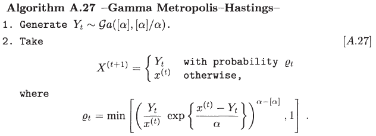
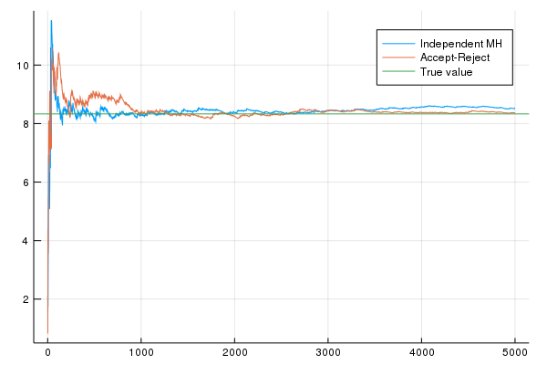

# Independent Metropolis-Hastings

## Gamma distribution

[Robert and Casella (2013)](https://www.springer.com/gp/book/9781475730715) presents the following algorithm:


If there exists a constant $$M$$ such that 

$$
f(x) \le Mg(x)\,,\qquad \forall x\in \mathrm{supp}\;f\,,
$$

the algorithm produces a uniformly ergodic chain ([Theorem](thm_imh.png)), and the expected acceptance probability associated with the algorithm is at least $$1/M$$ when the chain is stationary, and in that sense, the IMH is more efficient than the Accept-Reject algorithm.

Let's illustrate this algorithm with $${\mathcal G}a(\alpha, 1)$$. We have introduced how to sample from Gamma distribution via Accept-Reject algorithm in [Special Distributions](https://mc.hohoweiya.xyz/genrv/special), and it is straightforward to get the Gamma Metropolis-Hastings based on the ratio of $$f/g$$,



And we can implement this algorithm with the Julia code:

```julia
function mh_gamma(T = 100, alpha = 1.5)
    a = Int(floor(alpha))
    b = a/alpha
    x = ones(T+1) # initial value: 1
    for t = 1:T
        yt = rgamma_int(a, b)
        rt = (yt / x[t] * exp((x[t] - yt) / alpha))^(alpha-a)
        if rt >= 1
            x[t+1] = yt
        else
            u = rand()
            if u < rt
                x[t+1] = yt
            else
                x[t+1] = x[t]
            end
        end   
    end
    return(x)
end
```

To sample $${\mathcal G}a(2.43, 1)$$, and estimate $$\mathrm{E}_f(X^2)=2.43+2.43^2=8.33$$.

```julia
# comparison with accept-reject
res = mh_gamma(5000, 2.43)[2:end]
est = cumsum(res.^2) ./ collect(1:5000)

res2 = ones(5000)
for i = 1:5000
    res2[i] = rgamma(2.43, 1)
end
est2 = cumsum(res2.^2) ./ collect(1:5000)

using Plots
plot(est, label="Independent MH")
plot!(est2, label="Accept-Reject")
hline!([8.33], label="True value")
```

