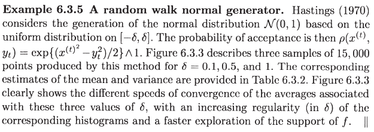

# Metropolis-Hastings Algorithm

Gibbs and Metropolis algoritgms are special cases of Metropolis-Hastings.

Consider a bivariate distribution for two random variables $$U$$ and $$V$$, $$p_0(u,v)$$.

## Gibbs

In Gibbs, given $$x^{(s)}=(u^{(s)},v^{(s)})$$, sample $$x^{s+1}$$ as follows.

1. Update $$U$$: sample $$u^{(s+1)}\sim p_0(u\mid v^{(s)})$$
2. Update $$V$$: sample $$v^{(s+1)}\sim p_0(v\mid u^{(s+1)})$$

Of course, we can change the sampling order.

## Metropolis-Hastings

No need to require the acceptance ratio to be symmetric.

1. Update $$U$$:
    1. sample $$u^*\sim J_u(u\mid u^{(s)}, v^{(s)})$$
    2. compute the acceptance ratio
    $$
    r=\frac{p_0(u^*, v^{(s)})}{p_0(u^{(s)},v^{(s)})}\times \frac{J_u(u^{s}\mid u^*, v^{(s)})}{J_u(u^*\mid u^{(s)},v^{(s)})}
    $$
    3. set $$u^{(s+1)}$$ to $$u^*$$ w.p. $$\mathrm{min}(1,r)$$.
2. Update $$V$$: similarly.

In the following sections, let's introduce other versions of Metropolis-Hastings.

## Independent Metropolis-Hastings

[Robert and Casella (2013)](https://www.springer.com/gp/book/9781475730715) presents the following algorithm:


Let's illustrate this algorithm with $${\mathcal G}a(\alpha, 1)$$. We have introduced how to sample from Gamma distribution via Accept-Reject algorithm in [Special Distributions](https://mc.hohoweiya.xyz/genrv/special), and it is straightforward to get the Gamma Metropolis-Hastings based on the ratio of $$f/g$$,


And we can implement this algorithm with the Julia code:

```julia
## Julia program for Gamma Metropolis-Hastings
## author: weiya <szcfweiya@gmail.com>
## date: 2018-08-21

## import function gamma_int
include("../GenRV/gamma.jl")

function mh_gamma(T = 100, alpha = 1.5)
    a = Int(floor(alpha))
    b = a/alpha
    x = ones(T+1) # initial value: 0 
    for t = 1:T
        yt = rgamma_int(a, 1)
        rt = (yt / x[t] * exp((x[t] - yt) / alpha))^(alpha-a)
        if rt >= 1
            x[t+1] = yt
        else
            u = rand()
            if u < rt
                x[t+1] = yt
            else
                x[t+1] = x[t]
            end
        end   
    end
    return(x)
end

# example
mh_gamma()
```

## Random walk Metropolis-Hastings


We can write the following Julia code which use uniform distribution $${\mathcal U}[-\delta,\delta]$$ as $$g$$.

```julia
# random walk Metropolis-Hastings
function rmh(T, delta, f::Function, initval = 5)
    x = ones(T+1)
    x[1] = initval
    for t = 1:T
        # generate Yt
        epsi = rand() * 2 * delta - delta
        Yt = epsi + x[t]
        # accept or not
        u = rand()
        r = f(Yt)/f(x[t])
        if r >= 1
            x[t+1] = Yt
        else
            if u <= r
                x[t+1] = Yt
            else
                x[t+1] = x[t]
            end
        end
    end
    return(x)
end
```

Then apply this algorithm to the normal distribution:



```julia
# density function of N(0, 1) without normalization
function dnorm(x)
    return(exp(-0.5 * x^2))
end

# example
deltalist = [0.1, 0.5, 1]
N = 15000
# results of mean and variance
muvar = zeros(3, 2)
using Statistics
ps = []
for i = 1:3
    x = rmh(N, deltalist[i], dnorm)
    push!(ps, plot(x, legend=:none))
    muvar[i, 1] = mean(x)
    muvar[i, 2] = var(x)
end
# plot
plot(ps[1], ps[2], ps[3], layout=(3,1))
savefig("res_rmh.png")
```

We will get the table of mean and variance as showed in Table 6.3.2 of [Robert and Casella (2013)](https://www.springer.com/gp/book/9781475730715) 


and the curve of each case:


## ARMS Metropolis-Hastings

ARMS stands for Adaptive Rejection Metropolis Sampling, and it is the generalization of [ARS algorithm](https://mc.hohoweiya.xyz/genrv#ars-algorithm).


We can implement this algorithm with the following Julia program:

```julia
include("../GenRV/ars.jl")
using Main.corears
# ARMS
function arms(T, yfixed::Array)
    x = ones(T+1)
    for t = 1:T
        # generate Y
        while true
            global y
            y = gplus_sample(yfixed)
            u = rand()
            u <= exp(h(y)-hplus(y, yfixed)) && break
        end
        # accept or not
        v = rand()
        r = exp(h(y))*phi(x[t], yfixed)/(exp(h(x[t]))*phi(y, yfixed))
        println(r)
        if r >= 1
            x[t+1] = y
        else
            if v <= r
                x[t+1] = y
            else
                x[t+1] = x[t]
            end
        end
    end
    return(x)
end
```

Now let's apply ARMS to poisson logistic model:


```julia
# data
x = rand(10)
y = rand(10)
# parameters
tau = 1

# function of h
function h(b)
    return(b * sum(x .* y) - sum(log.(1 .+ exp.(b*x))) - sum(1 .- 1 ./ (1 .+ exp.(b*x))) - b^2/(2*tau^2))
end

# derivative of h
function dh(b)
    return(sum(x .* y) - sum(x .* (1 .- 1 ./ (1 .+ exp.(b*x)) )) + sum(x .* exp.(b*x) ./ (1 .+ exp.(b*x)).^2 ) - b/tau^2)
end

function phi(x, yfixed::Array)
    if exp(h(x)) <= exp(hplus(x, yfixed))
        return(exp(h(x)))
    else
        return(exp(hplus(x, yfixed)))
    end
end
## example
x = arms(10000, [-1.5, -0.7, 0.7, 1.5])
```