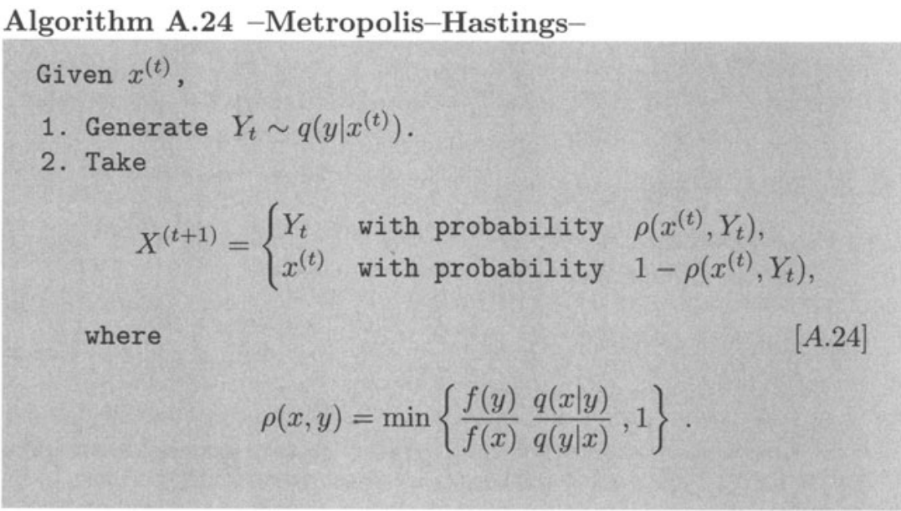

# Metropolis-Hastings Algorithm

<!--

Gibbs and Metropolis algoritgms are special cases of Metropolis-Hastings.

Consider a bivariate distribution for two random variables $$U$$ and $$V$$, $$p_0(u,v)$$.

## Gibbs

In Gibbs, given $$x^{(s)}=(u^{(s)},v^{(s)})$$, sample $$x^{s+1}$$ as follows.

1. Update $$U$$: sample $$u^{(s+1)}\sim p_0(u\mid v^{(s)})$$
2. Update $$V$$: sample $$v^{(s+1)}\sim p_0(v\mid u^{(s+1)})$$

Of course, we can change the sampling order.

## Metropolis-Hastings

No need to require the acceptance ratio to be symmetric.
-->

Remarks:

- A sample produced by the above algorithm differs from an iid sample. For one thing, such a sample may involve repeated occurrences of the same value, since rejection of $$Y_t$$ leads to repetition of $$X^{(t)}$$ at time $$t+1$$ (an impossible occurrence in absolutely continuous iid settings)
- Minimal regularity conditions on both $$f$$ and the conditional distribution $$q$$ for $$f$$ to be the limiting distribution of the chain $$X^{(t)}$$: $$\cup_{x\in \mathrm{supp}\, f}\mathrm{supp}\, q(y\mid x)\supset \mathrm{supp}\,,f$$.
- $$f$$ is the stationary distribution of the Metropolis chain: it satisfies the detailed balance property.
$$
K(x,y) = \rho(x,y)q(y\mid x)+(1-r(x))\delta_x(y)\,.
$$

The MH Markov chain has, by construction, an invariant probability distribution $$f$$, if it is also an aperiodic [Harris chain](../MarkovChain/def_harris_recurrent.png), then we can apply [ergodic theorem](../MarkovChain/thm_ergodic.png) to establish a [convergence result](thm_converge.png).
- A sufficient condition to be aperiodic: allow events such as $$\{X^{(t+1)}=X^{(t)}\}$$.
- Property of irreducibility: sufficient conditions such as positivity of the conditional density $$q$$.
- If the MH chain is $$f$$-irreducible, it is Harris recurrent.
- A somewhat less restrictive condition for irreducibility and aperiodicity.

<!--
Two components:

1. Update $$U$$:
    1. sample $$u^*\sim J_u(u\mid u^{(s)}, v^{(s)})$$
    2. compute the acceptance ratio
    $$
    r=\frac{p_0(u^*, v^{(s)})}{p_0(u^{(s)},v^{(s)})}\times \frac{J_u(u^{s}\mid u^*, v^{(s)})}{J_u(u^*\mid u^{(s)},v^{(s)})}
    $$
    3. set $$u^{(s+1)}$$ to $$u^*$$ w.p. $$\mathrm{min}(1,r)$$.
2. Update $$V$$: similarly.
-->

In the following sections, let's introduce other versions of Metropolis-Hastings.

