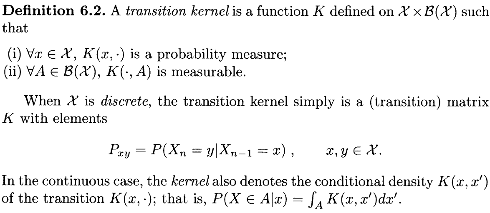
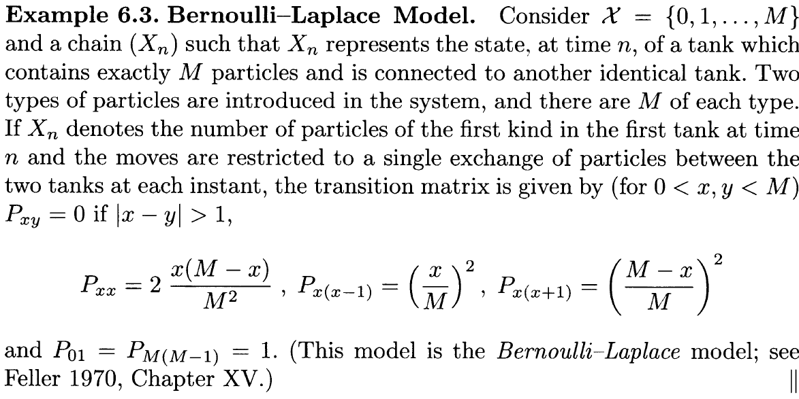
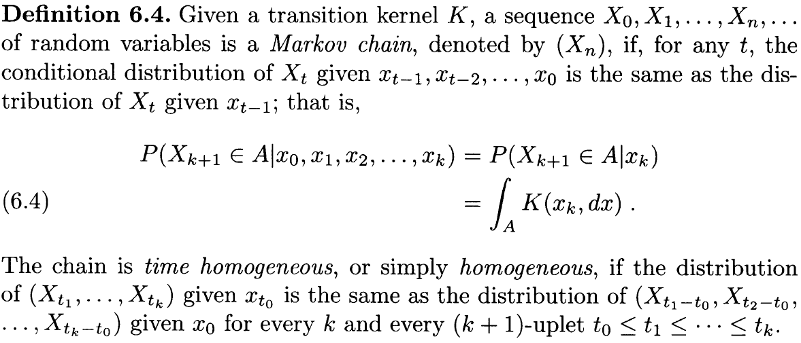

## Essential properties of Markov Chain

In the setup of MCMC algorithms, we construct Markov chains from a transition kernel $K$, a conditional probability density such that $$X_{n+1}\sim K(X_n,X_{n+1})$$.

The chain encountered in MCMC settings enjoy a very strong stability property, namely a **stationary probability distribution**; that is, a distribution $\pi$ such that if $X_n\sim\pi$, then $X_{n+1}\sim \pi$, if the kernel $K$ allows for free moves all over the state space. This freedom is called **irreducibility** in the theory of Markov chains and is formalized as the existence of $n\in\mathbb{N}$ such that $P(X_n\in A\mid X_0)>0$ for every $A$ such that $\pi(A)>0$. This property also ensures that most of the chains involved in MCMC algorithms are **recurrent** (that is, that the average number of visits to an arbitrary set $A$ is infinite), or even **Harris recurrent** (that is, such that the probability of an infinite number of returns to $A$ is 1).

**Harris recurrence** ensures that the chain has the same limiting behavior for every starting value instead of almost every starting value.

The stationary distribution is also a limiting distribution in the sense that the limiting distribution of $X_{n+1}$ is $\pi$ under the total variation norm, notwithstanding the initial value of $X_0$.

Strong forms of convergence are also encountered in MCMC settings, like geometric and uniform convergences. 

If the marginals are proper, for convergence we only need our chain to be aperiodic. A sufficient condition is  that $K(x_n,\cdot)>0$ (or, equivalently, $f(\cdot\mid x_n)>0$) in a neighborhood of $x_n$.

If the marginal are not proper, or if they do not exist, then the chain is not positive recurrent. It is either null recurrent, and both cases are bad.

## Basic Notions

