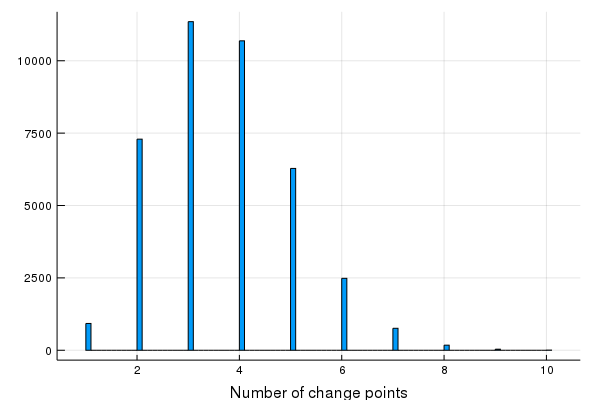
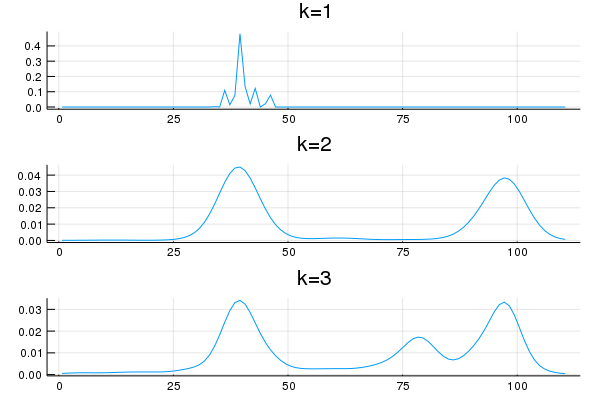

## RJMCMC for change points

The log-likelihood function is 

$$
\begin{aligned}
p(y\mid x) &= \sum_{i=1}^n\log\{x(y_i)\}-\int_0^Lx(t)dt\\
&= \sum_{j=1}^km_j\log h_j-\sum_{j=0}^kh_j(s_{j+1}-s_j)
\end{aligned}
$$

where $$m_j=\#\{y_i\in[s_j,s_{j+1})\}$$.

### H Move

1. choose one of $$h_0,h_1,\ldots,h_k$$ at random, obtaining $$h_j$$
2. propose a change to $$h_j'$$ such that $$\log(h_j'/h_j)\sim U[-\frac 12, \frac 12]$$.
3. the acceptance probability is 
$$
\begin{aligned}
\alpha(h_j, h_j') &=\frac{p(h_j'\mid y)}{p(h_j\mid y)}\times \frac{J(h_j\mid h_j')}{J(h_j'\mid h_j)}\\
&= \frac{p(y\mid h_j')}{p(y\mid h_j)}\times\frac{\pi(h_j')}{\pi(h_j)}\times\frac{J(h_j\mid h_j')}{J(h_j'\mid h_j)}\,.
\end{aligned}
$$
Note that 
$$
\log\frac{h_j'}{h_j}= u \,,
$$
it follows that the CDF of $$h_j'$$ is 
$$
F(x) = P(h_j'\le x) = P(e^uh\le x) = P(u\le \log(x/h)) = \log(x/h) + 1/2
$$
and 
$$
f(x) = F'(x) = \frac{1}{x}\,,
$$
so 
$$
J(h_j'\mid h_j) = \frac{1}{h_j'}\,.
$$
Then we have
$$
\begin{aligned}
\alpha(h_j,h_j') &= \frac{p(y\mid h_j')}{p(y\mid h_j)}\times \frac{(h_j')^{\alpha}\exp(-\beta h_j')}{h_j^\alpha\exp(-\beta h_j)}\\
&=\text{likelihood ratio}\times (h_j'/h_j)^\alpha\exp\{-\beta(h_j'-h_j)\}
\end{aligned}
$$

### P Move

1. Draw one of $$s_1,s_2,\ldots,s_k$$ at random, obtaining say $$s_j$$.
2. Propose $$s_j'\sim U[s_{j-1}, s_{j+1}]$$
3. The acceptance probability is 
$$
\begin{aligned}
\alpha(s_j,s_j') &=\frac{p(y\mid s_j')}{p(y\mid s_j)}\times \frac{\pi(s_j')}{\pi(s_j)}\times \frac{J(s_j\mid s_j')}{J(s_j'\mid s_j)}\\
&=\text{likelihood ratio}\times \frac{(s_{j+1}-s_j')(s_j'-s_{j-1})}{(s_{j+1}-s_j)(s_j-s_{j-1})}
\end{aligned}
$$
since 
$$
\pi(s_1,s_2,\ldots,s_k)=\frac{(2k+1)!}{L^{2k+1}}\prod_{j=0}^{k+1}(s_{j+1}-s_j)
$$

### Birth Move

Choose a position $$s^*$$ uniformly distributed on $$[0,L]$$, which must lie within an existing interval $$(s_j,s_{j+1})$$ w.p 1. 

Propose new heights $$h_j', h_{j+1}'$$ for the step function on the subintervals $$(s_j,s^*)$$ and $$(s^*,s_{j+1})$$. Use a weighted geometric mean for this compromise,

$$
(s^*-s_j)\log(h_j') + (s_{j+1}-s^*)\log(h_{j+1}')=(s_{j+1}-s_j)\log(h_j)
$$

and define the perturbation to be such that 

$$
\frac{h_{j+1}'}{h_j'}=\frac{1-u}{u}
$$

with $$u$$ drawn uniformly from $$[0,1]$$.

The prior ratio, becomes 

$$
\frac{p(k+1)}{p(k)}\frac{2(k+1)(2k+3)}{L^2}\frac{(s^*-s_j)*(s_{j+1}-s^*)}{s_{j+1}-s_j}\times \frac{\beta^\alpha}{\Gamma(\alpha)}\Big(\frac{h_j'h_{j+1}'}{h_j}\Big)^{\alpha-1}\exp\{-\beta(h_j'+h_{j+1}'-h)\}
$$

the proposal ration becomes 

$$
\frac{d_{k+1}L}{b_k(k+1)}
$$

and the Jacobian is 

$$
\frac{(h_j'+h_{j+1}')^2}{h_j}
$$

### Death Move

If $$s_{j+1}$$ is removed, the new height over the interval $$(s_j',s_{j+1}')=(s_j,s_{j+2})$$ is $$h_j'$$, the weighted geometric mean satisfying

$$
(s_{j+1}-s_j)\log(h_j) + (s_{j+2}-s_{j+1})\log(h_{j+1}) = (s_{j+1}'-s_j')\log(h_j')
$$

The acceptance probability for the corresponding death step has the same form with the appropriate change of labelling of the variables, and the ratio terms inverted.

## Results

The histogram of number of change points is 

And we can get the density plot of position (or height) conditional on the number of change points $$k$$, for example, the following plot is for the position when $$k=1,2,3$$

## References

1. [Green, P. J. (1995). Reversible jump Markov chain Monte Carlo computation and Bayesian model determination. Biometrika, 82(4), 711–732.](https://doi.org/10.1093/biomet/82.4.711)
2. [Sisson, S. A. (2005). Transdimensional Markov Chains: A Decade of Progress and Future Perspectives. Journal of the American Statistical Association, 100(471), 1077–1089.](https://doi.org/10.1198/016214505000000664)
3. [Peter Green's Fortran program AutoRJ](https://people.maths.bris.ac.uk/~mapjg/AutoRJ/)
4. [David Hastie's C program AutoMix](http://www.davidhastie.me.uk/software/automix/)
5. [Ai Jialin, Reversible Jump Markov Chain Monte Carlo Methods. MSc thesis, University of Leeds, Department of Statistics, 2011/12.](http://www1.maths.leeds.ac.uk/~voss/projects/2011-RJMCMC/)
