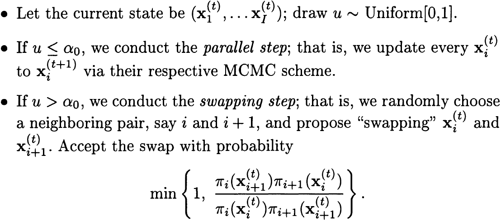
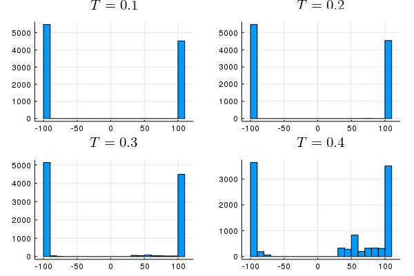
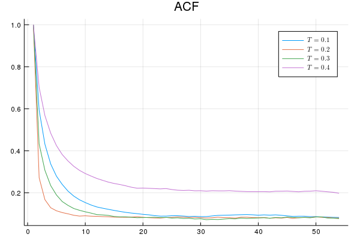

# Ising Model 

## General Chain-Structured Models

There is an important probability distribution used in applications (Liu, 2008):
$$
\pi(\mathbf x) \propto \exp\Big\{-\sum_{i=1}^dh_i(x_{i-1},x_i)\Big\} \equiv \exp(-H(\mathbf x)) \tag{*}
$$
where $$\mathbf x = (x_0,x_1,\ldots,x_d)$$. This type of model exhibits a so-called "Markovian structure" because 
$$
\pi(x_i\mid \mathbf x_{[-i]}) \propto \exp\{-h(x_{i-1},x_i)-h(x_i,x_{i+1})\}\,.
$$

We can simulate from $$\pi(\mathbf x)$$ by an exact method. Note that 
$$
Z\equiv \sum_{\mathbf x}\exp\{-H(\mathbf x)\} = \sum_{x_d}\Big[\cdots\Big[ \sum_{x_1}\Big\{\sum_{x_0}e^{-h(x_0,x_1)}\Big\}e^{-h_2(x_1,x_2)} \Big] \cdots\Big]\,.
$$
The simulating procedure is as follows:
1. Calculate $$V_1(x)=\sum_{x_0\in S}e^{-h(x_0,x_1)}$$
2. For $$t=2,\ldots,d$$, calculate 
$$
V_t(x) = \sum_{y\in S}V_{t-1}(y)e^{-h_t(y,x)}\,.
$$
3. $$Z=\sum_{x\in S}V_d(x)$$ and $$\pi(x_d)=V_d(x_d)/Z$$.
4. Draw $$x_d$$ from $$S$$ w.p. $$V_d(x_d)/Z$$.
5. For $$t=d-1,d-2,\ldots,1$$, draw $$x_t$$ from
$$
p_t(x) = \frac{V_t(x)e^{-h_{t+1}(x,x_{t+1})}}{\sum_{y\in S}V_t(y)e^{-h_{t+1}(y,x_{t+1})}}
$$

## Exact Method for Ising Model

For a one-dimensional Ising Model,
$$
\pi(\mathbf x)=Z^{-1}\exp\{\beta(x_0x_1+\cdots+x_{d-1}x_d)\}\,,
$$
where $$x_i\in\{-1,1\}$$. And thus the simulating procedure is much easy. Note that for $$t=1,\ldots,d$$,
$$
V_t(x) = (e^{-\beta}+e^{\beta})^t
$$
and $$Z=2(e^{-\beta}+e^{\beta})^d$$. 

We can use the following Julia program to simulate from $$\pi(\mathbf x)$$:
```julia
function exactMethod(M = 2000; beta = 10, d = 100)
    V = ones(d)
    V[1] = exp(beta) + exp(-beta)
    for t = 2:d
        V[t] = V[1] * V[t-1]
    end
    Z = 2*V[d]
    x = ones(Int, d)
    x[d] = 2*rand(Bernoulli(1/2))-1
    for t = (d-1):1
#        p1 = V[t] * exp(x[d] * 1)
#        p2 = V[t] * exp(x[d] * (-1))
        p1 = exp(x[d])
        p2 = exp(-x[d])
        x[t] = 2*rand(Bernoulli(p1/(p1+p2)))-1
    end
    return x
end
```

## Parallel Tempering for Ising Model

Liu (2008) also introduced the **parallel tempering** strategy:



I wrote the following Julia program to implement this procedure and reproduce the simulation example of Liu (2008):

```julia
function parallelTemper(M = 2000, T = [0.1, 0.2, 0.3, 0.4]; d = 100, alpha0 = T[1])
    I = length(T)
    # initial 
    x = 2*rand(Bernoulli(1/2), d, I) .- 1
    num1 = zeros(3)
    num2 = zeros(3)
    res = zeros(M, 4)
    for m = 1:M
        if rand() < alpha0 # parallel step
            #for i = 1:I
                # !!! Doesn't work !!!
                # y1 = x[:,i]
                # sampleX!(x[:,i], T[i])
                # y2 = x[:,i]
                # println(sum(abs.(y2.-y1)))
            #end
            sampleX!(x, T)
        else
#            idx = sample(1:I, 2, replace = false) # not neigbor
            idx1 = sample(1:(I-1))
            num1[idx1] += 1
            idx = [idx1, idx1+1]
#            rho = pdfIsing(x[:,idx[2]], T[idx[1]]) * pdfIsing(x[:,idx[1]], T[idx[2]]) / (pdfIsing(x[:,idx[1]], T[idx[1]]) * pdfIsing(x[:,idx[2]], T[idx[2]]))
            rho = logpdfIsing(x[:,idx[2]], T[idx[1]]) + logpdfIsing(x[:,idx[1]], T[idx[2]]) - (logpdfIsing(x[:,idx[1]], T[idx[1]]) + logpdfIsing(x[:,idx[2]], T[idx[2]]))
            if log(rand()) < rho
                # swappin step
                num2[idx1] += 1
                tmp = copy(x[:, idx[1]])
                x[:,idx[1]] .= x[:, idx[2]]
                x[:,idx[2]] .= tmp
            end
        end
        res[m, :] = sum(x, dims=1)
    end
    return res, num2 ./ num1
end
```

It is important to note that we should use `logpdf` to avoid too big values, in which the rejection part doesn't work well. Refer to [Ising-model.jl](https://github.com/szcf-weiya/MonteCarlo/blob/master/Tempering/Ising-Model/Ising-model.jl) for complete source code.

Finally, I reproduce the Figure 10.1 as follows:



and the corresponding autocorrelation plots:




